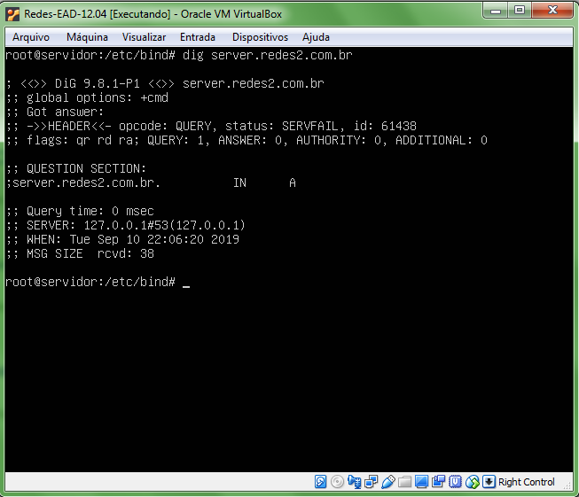
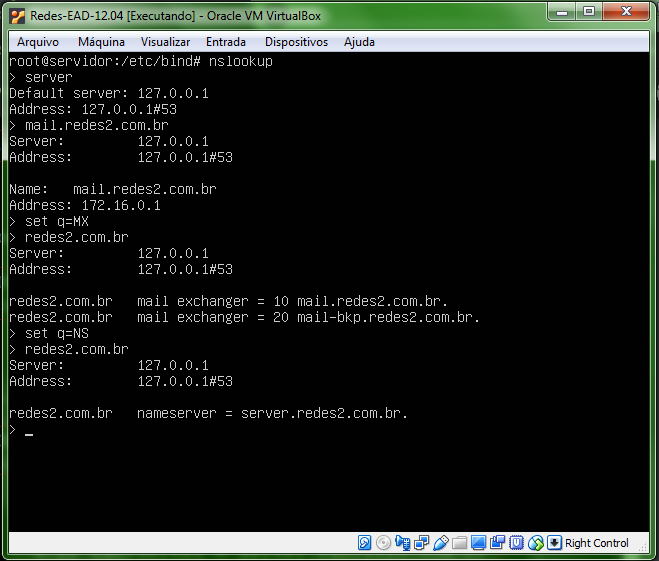

# Configuração Serviço de DNS

Este documento detalha os passos necessários para realizar a configuração de um servidor DNS. Atividade que faz parte da disciplina Redes de Computadores 2 do curso de Sistemas para Internet `IFRS Poa`. Atividade realizada junto com a colega [Rafaela](https://github.com/rafcristina152)


## Configuration

### VirtualBox

Para passo-a-passo foi utilizado o VirtualBox, que pode ser baixado neste link [VirtualBox](https://www.virtualbox.org/wiki/Downloads). Os comandos e etapas necessários para instalação do VirtualBox você pode conferir neste [link](https://www.techtudo.com.br/dicas-e-tutoriais/noticia/2013/03/descubra-como-instalar-o-virtualbox-e-seu-pacote-de-extensoes-e-facil.html)

### Putty

Para simular acesso remoto ao servidor, para a atividade nós utilizamos o [PuTTy](https://www.putty.org/). Baixe a versão mais estável do seu sistema operacional. 

### Máquina virtual

Após a instalação do VirtualBox, baixe esta [máquina virtual](http://www.pop-rs.rnp.br/~cesar/Redes-EAD-12.04.ova). Com o VirtualBox aberto, importe a máquina virtual baixada. Se você não souber como fazer isso, veja [esse exemplo](https://www.youtube.com/watch?v=b74I9f9SNx0). NÃO DÊ O PLAY!!! É necessário fazer alguns ajustes antes.


### VirtualBox-Ajuste!!

Antes de dar o Play, é preciso fazer alguns ajustes na máquina virtual importada.

1.  Selecione a opção Configurações no menu do VirtualBox e, no menu esquerdo da janela que irá aparecer, selecione a opção Redes. Desmarque a opção "Habilitar Placa de Rede" do adaptador 1 e habilite o adaptador 2 em modo Bridge.
Após realizar essas configurações, inicie a máquina virtual.


2.  Aguarde a máquina iniciar completamente, etapa que pode demorar alguns minutos. Se uma tela semelhante à imagem a seguir surgiu no seu monitor, significa que você está no caminho certo.
Agora digite o usuário "aluno" e a senha "aluno". 


3.  Após fazer o login, execute o comando `ifconfig` para verificar as configurações das interfaces de rede. Caso liste apenas a interface local, devemos fazer mais algumas configurações para habilitar a conexão Ethernet.


4.  Execute o comando `ip link show` para verificar as características dos dispositivos de rede. Na imagem abaixo, temos os dispositivos **lo** e **eth3** (preste bastante atenção no número após o eth).


> Caso deseje, você poderá utilizar a ferramenta PuTTY para acessar de forma remota a sua máquina virtual.
 Para isso, é necessário que você informe o Host Name (localhost) e a porta (5000). Se quiser salvar a sua sessão, informe  um nome para ela no campo Saved Sessions e selecione o botão Save.
 Após esses passos, clique duas vezes no nome da sessão que você acabou de criar e informe as mesmas credenciais que você informou na máquina virtual (login aluno e senha aluno) e o ambiente remoto estará pronto para uso.


5.  Para que o dispositivo **eth3** apareça após o comando ifconfig, é necessário listá-lo dentro do arquivo que registra as interfaces de rede. Para isso, digite `vi /etc/network/interfaces`. Importante: para fazer alterações nesses arquivos, você deve estar com a permissão de super usuário `sudo su`.


6.  Observe que o arquivo apresenta o dispositivo **eth0** e não o **eth3** que é o nosso dispositivo. Precisamos, então, editar este arquivo com a informação correta para que ele apareça listado após o `ifconfig`. Selecione a **tecla I** ou **Insert** para poder editar o texto e utilize as setas do teclado para navegar até a linha desejada. Onde estiver escrito **eth0**, troque para eth + o número que apareceu na etapa 4. Aperte a **tecla ESC** para sair do modo de edição e digite `:wq` para salvar as alterações e sair do arquivo.


7.  Agora você deve executar o comando `/etc/init.d/networking restart` para reiniciar o serviço.


8.  Agora o dispositivo **eth3** deverá aparecer após o comando `ifconfig`.


> Para evitar possíveis erros, execute o comando `apt-get update` para atualizar os pacotes de todas as fontes configuradas.
> Até o momento, fizemos algumas verificações e configurações. A instalação do serviço de DNS começa a partir daqui.

9.  Execute o comando `apt-get install bind9`. Digite `S` quando o terminal perguntar se você deseja continuar. Mais informações sobre o bind9 você encontra [aqui](https://wiki.debian.org/Bind9) e [aqui](https://www.isc.org/bind/)


10.  Quando a instalação do **bind** for concluída, entre na pasta dos arquivos de configuração `cd /etc/bind`. Com o comando `ls` você poderá ver uma lista dos arquivos da pasta **bind**. Vamos executar o comando `cat` para ver o conteúdo do arquivo `named.conf`. Você verá que o arquivo chama outros arquivos da pasta **bind** através de `includes`. Observe que os comentários do arquivo informam que, se você desejar adicionar zonas, deverá fazer isso no arquivo `named.conf.local` e é justamente isso que vamos fazer no passo a seguir.


11.  Edite o arquivo `named.conf.local` (`vi named.conf.local`) para registrar a zona que vamos criar. No nosso exemplo, criamos a zona `redes2.com.br`, mas você pode substituir o termo **redes2** pelo nome que preferir. Veja que o arquivo `db.redes2` ainda não existe, então, precisamos criá-lo.


12. Para criar o arquivo `db.redes2`, digite o comando `touch db.redes2`. Veja se ele foi criado corretamente com o comando `ls`.


13. Apesar de criado, o arquivo `db.redes2` está vazio (`cat db.redes2`), então precisamos preenchê-lo de forma semelhante ao `db.local`. O comando `cp db.local db.redes2` irá copiar o conteúdo do `db.local` para o `db.redes2`.


14. Antes de editar o arquivo `db.redes2`, precisamos fazer uma nova configuração na nossa máquina virtual. É importante que você desligue a máquina para que o VirtualBox desbloqueie as opções. Voltando na tela de gerenciamento do VirtualBox, selecione a opção Configurações no menu como fizemos lá no começo do tutorial. Novamente, selecione a opção Redes no menu lateral esquerdo da janela de configurações. Na aba adaptador 3, habilite a placa de rede, selecione "Rede Interna" no campo "Conectado a" e inicie a máquina novamente.


15. Lembre-se de entrar no modo super usuário novamente `sudo su`. Se você der o comando `ifconfig -a`, verá que existe um novo dispositivo de rede na listagem, mas que não possui endereço IP. No nosso caso, é o dispositivo **eth4**, mas o seu poderá apresentar um número diferente.


16. Lembre-se de entrar no modo super usuário novamente `sudo su`. Se você der o comando `ifconfig -a`, verá que existe um novo dispositivo de rede na listagem, mas que não possui endereço IP. No nosso caso, é o dispositivo **eth4**, mas o seu poderá apresentar um número diferente.


17.  Neste dispositivo, vamos atribuir um IP fixo. Acesse, então, o arquivo `/etc/network/interfaces` (`vi /etc/network/interfaces`) e preencha como está na imagem (**I** ou **Insert** para editar). Não esqueça que o seu dispositivo deve ser aquele que apareceu listado após o `ifconfig -a`. Pressione **ESC** e digite `:wq` para salvar e sair. Reinicie o serviço com `/etc/init.d/networking restart`.


18. Dê `ifconfig` e verifique que o novo dispositivo tem IP e máscara exatamente iguais aqueles que definimos no passo anterior.


19. Agora podemos, finalmente, editar o arquivo `db.redes2`. Entre na pasta bind (`cd /etc/bind`) e digite `vi db.redes2`.


20. Realize as modificações de acordo com o a imagem abaixo. **ESC** e `:wq` para salvar e sair do arquivo. Reinicie o serviço do bind com o comando `/etc/init.d/bind9 restart`.


21. Para testar o serviço de DNS, digite o comando nslookup, que serve para se obter informações sobre registros de DNS de um determinado domínio, host ou IP. Para nossos testes, utilizamos o endereço www.ifrs.edu.br.


22. Se testarmos o nosso servidor, vamos verificar que irá dar erro. O problema aqui é que ele está perguntando ao servidor DNS do roteador 200.132.52.65 e não o que configuramos.


23. Vamos, então, resolver esse problema. Primeiro entre na pasta `cd /etc`, depois digite vi resolv.conf para configurar o IP do servidor DNS. Em name server, informe o IP 127.0.0.1. Importante: toda vez que você reiniciar a máquina, o nameserver será trocado para o valor inicial.


24. Vamos testar o nosso servidor. Digite ping www.terra.com.br. Se o seu funcionou, maravilha! O seu servidor foi configurado corretamente. Se der erro, como no nosso caso, vamos fazer alguns passos extras.


25. Entre na pasta bind (cd /etc/bind) e edite o arquivo named.conf.options (vi named.conf.options). Comente as linhas destacadas em amarelo utilizando #.


26. Reinicie o serviço do bind (/etc/init.d/bind9 restart) e teste novamente o ping www.terra.com.br. 


27. Teste do comando dig server.redes2.com.br



28. Teste do comando host 127.0.0.1


### Adicionando outros serviços do DNS

Para disponibilizar outros serviços do DNS, como, por exemplo, e-mail, basta configurar, novamente, o arquivo db.redes2.


Após salvar as modificações com `:wq`, reinicialize o sistema com `/etc/init.d/bind9 restart`. 

Confira o log do sistema com `cat /var/log/syslog`.  Veja que a zona redes2.com.br carregada.


Para testar se está funcionando o serviço de e-mail do DNS, digite nslookup. Em seguinte, execute os seguintes comandos:

```>server
> mail.redes2.com.br
> set q=MX
> redes2.com.br
> set q=NS
> redes.com.br 
```


### Zona REVERSA

As instruções a seguir definem os passos para configurar a zona reversa do DNS, ou seja, obter o nome do computador na rede através de um **IP**.

O primeiro passo é a criação de um arquivo de configuração chamado **db.172.16** na pasta bind `/etc/bind`. Para a construção do arquivo de configuração, usaremos como base o **db.127**, arquivo presente também na pasta bind. Execute, então, o comando `cp db.127 db.172.16`.


Abra o arquivo named.conf.local no `vi named.conf.local` para adicionar a zona criada como na imagem abaixo.


Agora, abra o arquivo **db.172.16** no vi e faça as alterações de acordo com a imagem abaixo. Não esqueça de trocar onde está escrito redes2 pelo nome que você vem utilizando até agora ao longo do tutorial.


Antes de testarmos nosso serviço, execute o comando `/etc/init.d/bind9 restart` para reiniciá-lo e `cat /var/log/syslog` para verificar eventuais erros que possam ocorrer.


Teste o comando host 172.16.0.1


Teste o comando nslookup


Teste o comando dig 172.16.0.1


